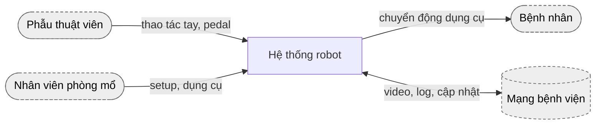
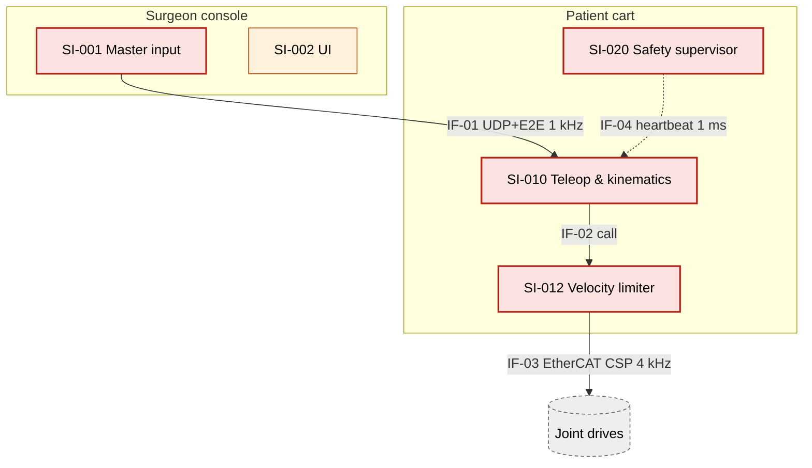
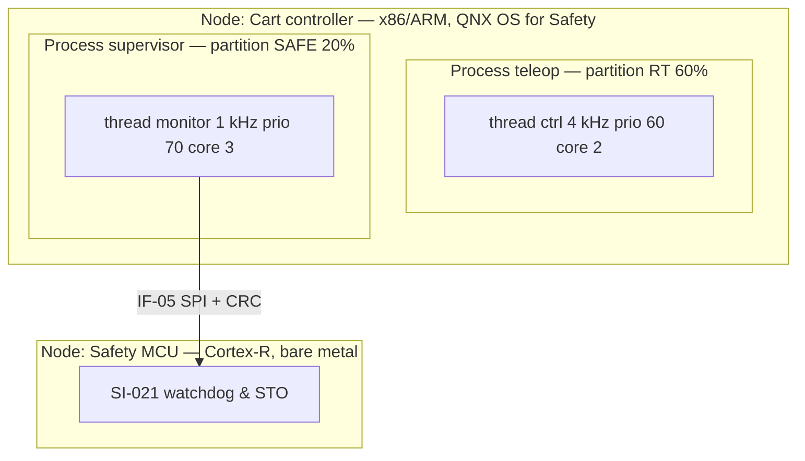
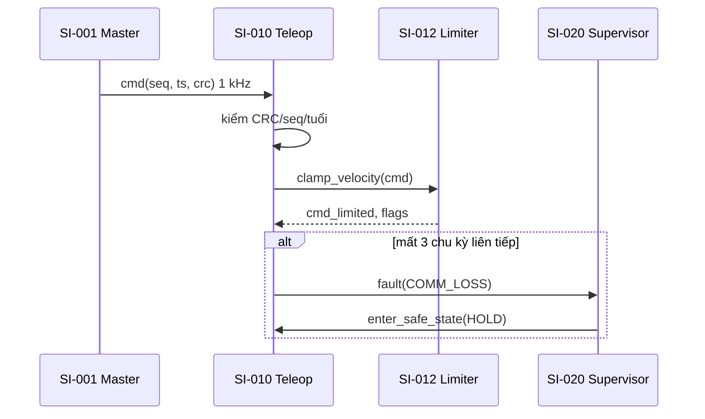
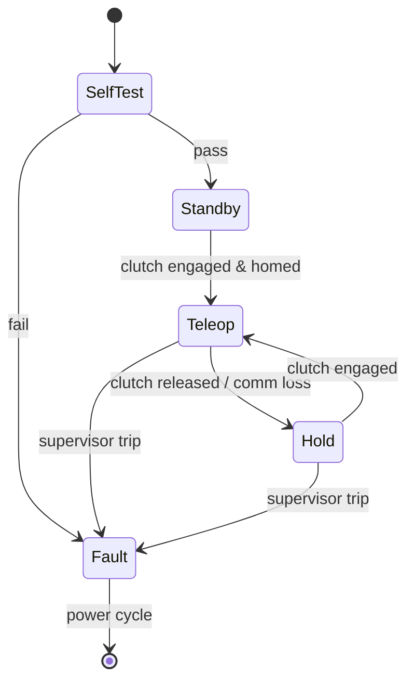
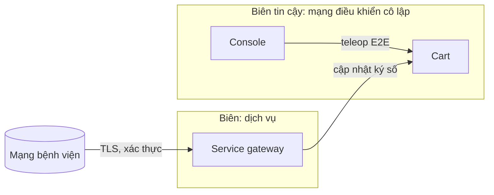

# Quy ước sơ đồ kiến trúc (Mermaid)

## Quy tắc
- Mỗi sơ đồ: tiêu đề `FIG-<tài liệu>-nn — <tên>`, chú thích 1–2 câu, legend nếu dùng màu/kiểu đường.
- Tên node = ID + tên ngắn khớp bảng (`SI012[SI-012 Velocity limiter]`). Không có phần tử nào không có trong bảng của tài liệu.
- ≤ ~25 phần tử mỗi sơ đồ; nhiều hơn → tách theo subsystem.
- Màu theo safety class (dùng thống nhất mọi tài liệu): C đỏ, B cam, A xanh, HW/SOUP xám.
- Mũi tên có nhãn: interface ID + giao thức/chu kỳ (`IF-03 EtherCAT 4 kHz`).
- Nộp hồ sơ: xuất SVG/PDF bằng mermaid-cli (`mmdc -i SAD.md -o out/`) — công cụ ghi vào danh sách tool; nếu công ty dùng
  Enterprise Architect/Cameo (SysML), sơ đồ gốc ở công cụ đó, markdown nhúng ảnh xuất + ghi phiên bản model.

```
classDef clsC fill:#fde2e2,stroke:#b42318,stroke-width:2px,color:#000;
classDef clsB fill:#fff1db,stroke:#b54708,color:#000;
classDef clsA fill:#e3f2e8,stroke:#067647,color:#000;
classDef ext  fill:#eeeeee,stroke:#666,stroke-dasharray: 4 3,color:#000;
```

## Context (SyAD/SAD)


## Decomposition + interface (SAD)


## Deployment


## Dynamic (luồng chính + đường lỗi)


## State / mode


## Data flow & trust boundary (threat model)

